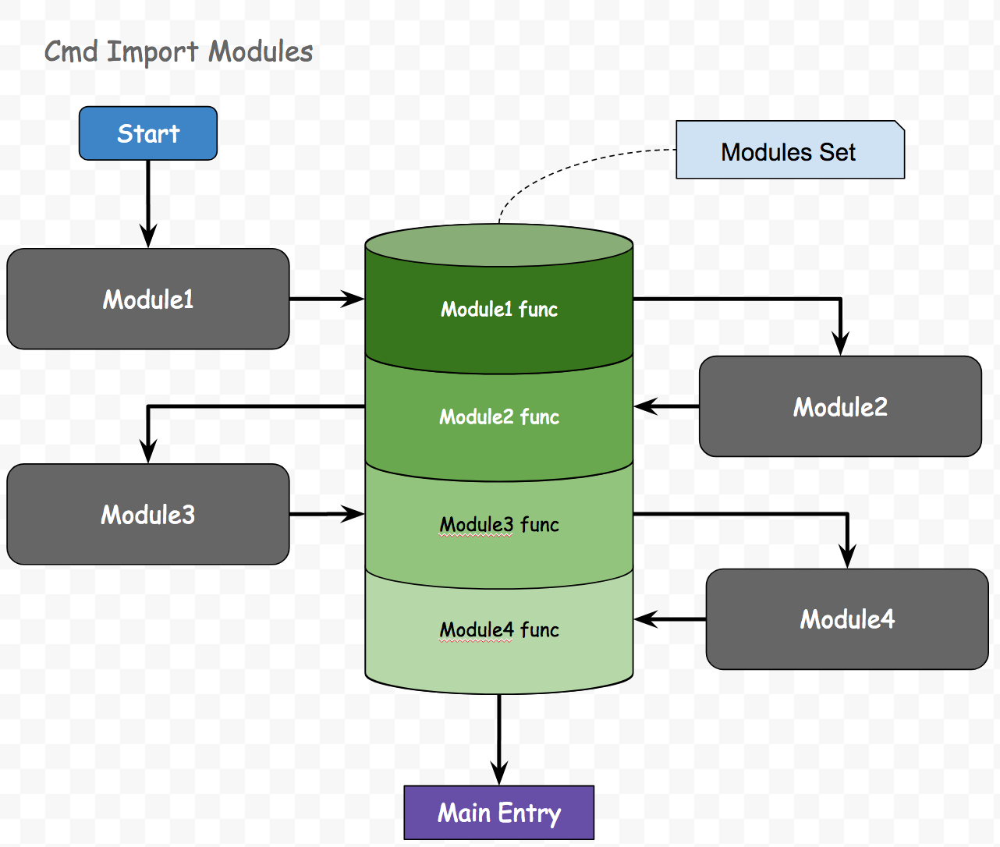

# dongtata.js

> 文档不断完善中，如有问题请帮忙提出，多谢


dongtata名字起源于《海贼王》的咚塔塔小人组，寓意小而强大，主要提供的功能是比目前CMD和AMD更加高效快速的模块管理和简单的view编写，dongtata目前还依赖与zepto的Promise，Ajax，event功能，之后会实现该功能并且移除zepto；

**done:**
- [x] 模块管理
- [x] 优化模块管理
- [x] view层功能

**to do:**
- [ ] 移除zepto
- [ ] 工程化模块管理，移除公式化代码
- [ ] 增加必要的生命周期 done 和 update
- [ ] 增加jsx
- [ ] 增加对照数据

## module.js
> 高效的模块管理

目前js加载的性能瓶颈在哪里？这需要从几个方面来看，网络层面和js执行层面。

### 网络层面：
- ***体积越大下载越慢***
普观目前的前端项目，臃肿是一个很大的问题，其中有很多的工程和组件化的代码，以及许多第三方组件；其中第三方组件大而全的功能，是臃肿的主要原因，使用20%的功能，却要承受4倍的文件大小；
- ***文件越多执行下载越慢***
把大型的单个js文件拆开的又会产生多次网络请求的问题，这上面耗费的时间通常在于`DNS Lookup` `Inital connection`，当然这个两个问题可以通过DNS预链接，建立长链接或者http2来解决，但长链接也有可能因为服务器设置心跳包断掉，或者上一个链接数据还没返回而阻塞，所以又引入域名碎片化来优化，但是问题来了，一次下载和多次下载到底能够节省多少时间？其实答案不是特别确定的，大家可以做个实验在，大小在50k以内的js加载速度，1vs多其实相差不大，如果是在移动网络条件下，多次网络握手的成功率也却更令人担忧。

### js执行层面
目前使用cmd，amd的模式都会遇到一个问题，初始运行时模块引用链很长以及需要执行一遍所有模块声明，造成主入口执行滞后
dongtata的module.js就是来解决这个两个问题：

#### 模块引用链很长
模块之间相互依赖，导致import一个js，之后相应的引用都需要被加载一遍，AMD和CMD都会存在此问题；
CMD引用一个模块的时候，通常这样写：
```
// es5
var module1 = require('Module1');
var moduel2 = require('Module2');

// es6
import module3 from 'Module3';
import module4 from 'Module4';
```

es5 `require` 方式可以不在顶部开始加载
es6 `import` 只能放在顶部位置
但一般方式都是写在顶部，这样就会造成十分严重的引用链过长的问题


#### 主入口执行滞后
通俗的来说就是：从开始加载js到运行到主入口时间过长，AMD因为只加载要运行的部分，所以就`执行所有模块声明，获得模块实例`此项问题没有CMD严重，但是依然存在问题；
所有的模块在真正运行到主函数之前都会执行声明获得export的实例，所以模块越多，执行时间越长。如果在声明部分执行一些耗时的逻辑，这样这个模块获得模块实例的时间更长，看一下以下的例子：
```
var chineseName = ['上海', '北京', '广州', '南京', '苏州'];
var enNames = ['ShangHai', 'BeiJin', 'GuangZhou', 'NanJin', 'SuZhou'];
var locationSet = {};
console.time("locationSet composite");
for (var i=0; i < enNames.length; i++) {
    locationSet[enNames[i]] = {
        'enName': enNames[i],
        'cnName': chineseName[i]
    }
}
console.timeEnd("locationSet composite");
module.exports = locationSet;
```
最后输出的时间是`locationSet composite: 0.23193359375ms`;
并且这些时间是虽然计算复杂度和模块数量递增。


### module.js如何上述问题
为了提高成功和复用缓存，我会选择使用单个打包，另外module.js可以好好解决js执行层面的问题。
```
define('TestModule', function moduleWrap(require){
    var a = require('A');
    var b = require('B');
    var result = {
        'name': 'HuangChunhua'
    };
    return result;
});
```
module.js的模块定义如上，和requirejs的做法看起来很像，但是又有所不同，在执行模块声明操作的时候，存储的结果并不是result，而是moduleWrap（一个函数声明），只有通过设置define的第二个参数，设置为true的时候，整个app才能开始运行。可以开脑洞的一点是，module.js支持分阶段执行。只有在define中执行require函数之后才能获得模块的最终实例。
```
define(function(require){
    var a = require('TestModule');
    alert(a.name);
}, true);
```
其中原理非常简单，执行函数声明是0.0Xms级别的，而执行函数则不可预计，所以可以dongtata的module.js可以比其他更快的执行就在于，他没有把所有的模块里的逻辑都走一遍，只是执行了模块的函数声明而已。



## widget.js
> 小巧的view层

widget.js 的事件处理是借助于zepto的事件委托机制，除了这点外，widget本身所承载的代码和功能都非常简单（差一个jsx就变得高大尚），请尽量别使用zepto提供的其他功能，如`$('div > span')`,h5已经提供了足够好的`querySelector`与`querySelectorAll`，所以没有理由相信js的实现比原生功能还快是吧，就目前来说，zepto是widget最大的性能瓶颈。
但大家别灰心，widget仍然足够好到你可以使用他来简单的完成view组件的操作。
要快，就要简单，直线永远是最近的，如果你硬要和我来谈“曲绕空间的话”，之后请私信我。
### 生命周期
复杂的生命周期是widget第一要避免的，我想声明的是reactjs的有很多声明钩子：
- 实例化：
    - getInitialState
    - componentWillMount
    - render
    - componentDidMount
- 更新
    - componentWillRecieveProps
    - shouldComponentUpdate
    - componentWillUpdate
    - render
    - componentDidUpdate
- 销毁
    - componentWillUnmount

但是实际上根据项目复杂程度来说，这些生命钩子并非都需要，举个简单的例子，一个简单的资讯页面，从上而下堆砌，本身就能够做到所有的功能，有的朋友说，那你为什么不用server端渲染，php，jsp，asp.net都比你做的要好，那我只能说，没错，纯从页面渲染的角度来说的确是这样，但是如果打组合拳的化，那就不是这样了，webview复用 + json的形式速度绝对超越你想想，以后会单开一个项目来解释。

但是一个更加复杂的项目，比如视频网站，则更加需要一些生命周期的控制，所以复杂度这种东西都是由业务决定的，而底层组建是独立于业务的，所以写组建就应该简单。

**Widget的必要参数:**


Name        | dataType      | Description                                       
------------|---------------|---------------------------------------------------
tagName     | string        | html tags: div, span, label,或者customer Element   
id          | string        | 组件的id                                            
className   | string        | 样式类名
create      | Func          | 初始化函数，create函数主要是用作第一次初始化的时候使用，只会被执行一次
events      | Object        | 事件集合（使用zepto时间委托机制）
el          | HtmlElement   | widget的html产出

> 请不要篡改以上属性的数据类型，以免发生错误

##### events:
单独讲一下events, 使用的是zepto的事件委托，使用者可以单独绑定click，也可以使用事件 + 选择器的方式进行绑定事件
```
events: {
    'click': function (e) {
        alert('This is Widget\'s click');
    },
    "click div": function (e) {
        alert('This is div\'s click');
    }
}
```


另外有一点，大家认为生命周期钩子可以有效的去解决性能衡量的事情，那这个问题就应该提出另外一个问题，什么时候开始衡量性能，所有的生命钩子都是在组建内部的，换句话说，这个组建已经开始被创建了，那么就会有误差，所以从实际角度出发来衡量一个组建的性能应该是从new这个组建或者new这个组建到appendChild之后的时间，这里还应该和FirstPaint的概念区分出来，因为appendChild 不等于立即绘制，所以性能的问题主要还是取决于使用者的衡量标准，而生命钩子的准确度本身是不够的。

## Hello World
先去zepto的网站，下载zepto，或者使用libs中zepto库
```
<!DOCTYPE html>
<html>
    <head>
        <meta name="viewport" content="width=device-width,initial-scale=1.0, minimum-scale=1.0, maximum-scale=1.0, user-scalable=no,minimal-ui">
        <meta charset="utf-8">
        <style>
            .helloworld {
                color: #999;
                size: 30px;
            }
        </style>
    </head>
    <body>
        <script>
            console.time("time to main");
        </script>
        <script>
            console.time("time to run zepto");
        </script>
        <script type="text/javascript" src="../../libs/zepto.js"></script>
        <script>
            console.timeEnd("time to run zepto");
        </script>
        <script type="text/javascript" src="../../module.js"></script>
        <script type="text/javascript" src="../../widget.js"></script>
        <script type="text/javascript" src="./helloworld.js"></script>
        <script type="text/javascript" src="./main.js"></script>
    </body>
</html>


```

***helloworld.js***
```
/**
* Hello world 组件
* @file helloworld.js
* @author Seed Huang
*/
console.time('loading module Hello World');
define("HelloWorld", function(require){
    console.time('init HelloWorld');
    var Widget = require("Bd:Widget");
    var widgetObj = {
        'tagName': 'div',
        'className': 'helloworld',
        'id': 'helloworld',
        'create': function () {
            this.el.innerHTML = 'Hello World';
        }
    };
    var HelloWorldWidget = Widget.extend(widgetObj);
    console.timeEnd('init HelloWorld');
    return HelloWorldWidget;
});
console.timeEnd('loading module Hello World');
```
***main.js***
```
/**
* Hello World的主要入口
* @file main.js
* @author Seed Huang
*/
define("Main", function(require){
    console.timeEnd("time to main");
    console.time("time to display hello world");
    var HelloWorld = require("HelloWorld");
    var helloWorld = new HelloWorld();
    document.body.appendChild(helloWorld.el);
    console.timeEnd("time to display hello world");
}, true);
```
最后打印出的时间是
```
time to run zepto: 19.903076171875ms
loading module Hello World: 0.01416015625ms
time to main: 25.005126953125ms
init HelloWorld: 0.157958984375ms
time to display hello world: 0.874267578125ms
```
看一下我一直诟病的模块加载速度的问题
**locationSet vs HelloWorld**

locationSet         | Loading HelloWorld  | init HelloWorld
--------------------|---------------------|---------------------
0.23193359375ms     | 0.01416015625ms     | 0.157958984375ms

结果很明显：locationSet加载和初始化是在一起的，HelloWorld将“加载”和“初始化”化分开，但0.014ms * 10也只有0.14ms，比单个locationSet组件“加载+初始化”的时间还要短，而HelloWorld init使用了0.15ms，但是这个过程已经在main函数以内，执行的是必要执行的模块，所以这个是必要消耗。另外值得注意的一方面是zepto这种IIFE形式的类库的确会阻断程序往下走，这里需要重点优化。


At Last：对于dongtata，我的结论是足够快，但是仍有很大的优化空间，后续zepto干掉，性能再飞跃一步。
