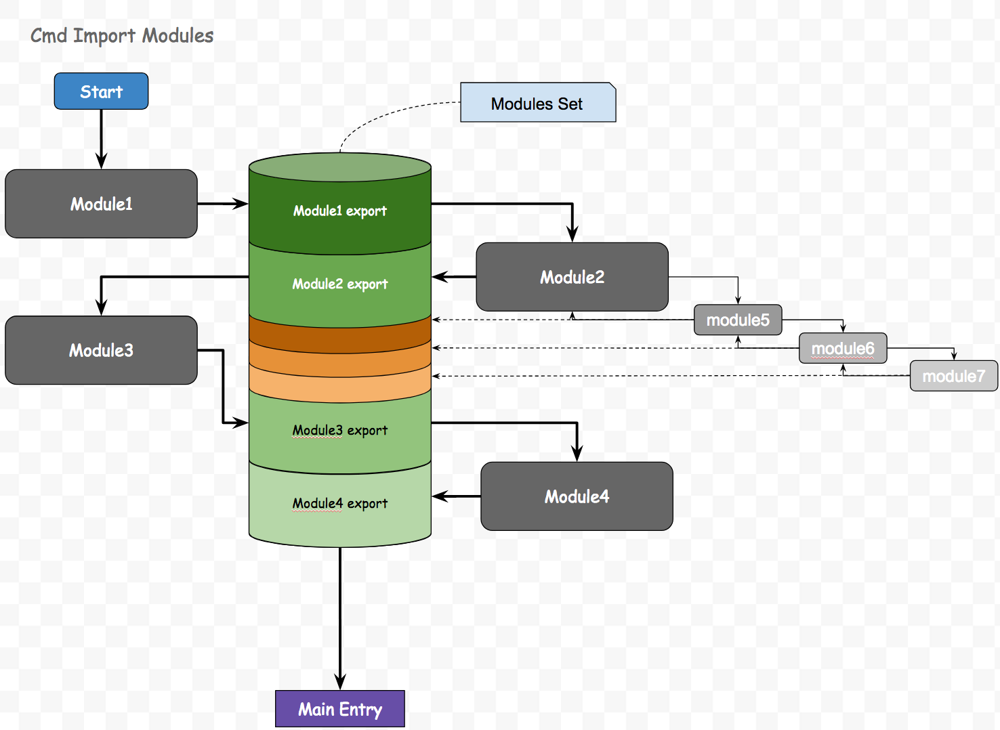

# dongtata.js

dongtata名字起源于《海贼王》的咚塔塔小人组，寓意小而强大，主要提供的功能是模块管理和view编写，dongtata目前还依赖与zepto的Promise，Ajax，event功能，之后会实现该功能并且移除zepto；

## module.js
> 高效的模块管理

目前使用cmd，amd的模式都会遇到一个问题，模块引用链很长以及主入口执行滞后
dongtata的module.js就是来解决这个两个问题：

### 模块引用链很长
模块之间相互依赖，导致import一个js，之后相应的引用都需要被加载一遍，AMD和CMD都会存在此问题；


### 主入口执行滞后
通俗的来说就是：从开始加载js到运行到主入口时间过长，AMD因为只加载要运行的部分，所以此项问题没有CMD严重，但是依然存在问题；

CMD引用一个模块的时候，通常这样写
```
// es5
var module1 = require('Module1');
var moduel2 = require('Module2');

// es6
import module3 from 'Module3';
import module4 from 'Module4';
```

es5 `require` 方式可以不在顶部开始加载
es6 `import` 只能放在顶部位置
但一般方式都是写在顶部，这样就会造成十分严重的引用链过长的问题

## widget.js
> 小巧的view层
